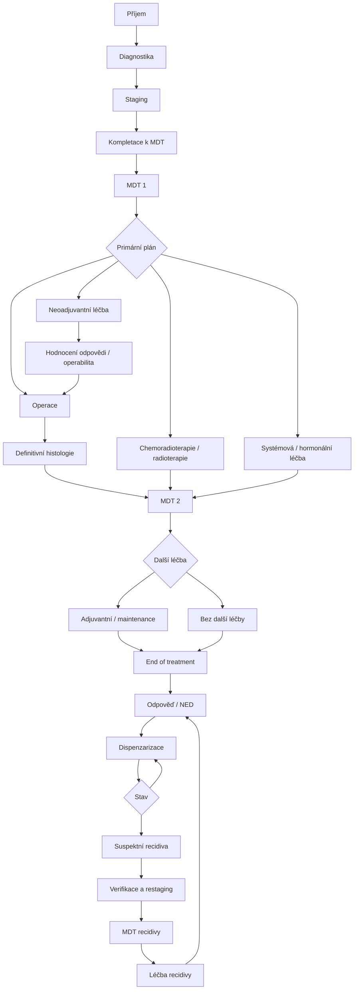

# Cílový klinický workflow OnkoFlow

Tento dokument je cílovou specifikací registru. V uživatelském rozhraní se používá
zkratka **MDT** — multidisciplinární tým. Dočasné stavy jako „čeká na termín“,
„dnes“ a „čeká na výsledek“ nejsou samostatné fáze; počítají se z data, výsledku
a dokončenosti podkladů uvnitř příslušné klinické fáze.

## 1. Příjem

- důvod odeslání a stav verifikace malignity;
- anamnéza, klinické a gynekologické vyšetření;
- ECOG/WHO performance status, komorbidity;
- reprodukční plány a menopauzální stav;
- dostupná dokumentace;
- koordinátor a odpovědný lékař.

## 2. Diagnostika

- biopsie, konizace, hysteroskopie, kyretáž nebo operační materiál;
- histologická diagnóza, histotyp, grade a relevantní IHC;
- případná revize referenčním patologem;
- molekulární/prediktivní diagnostika podle diagnózy a léčebné situace;
- možnost, že definitivní verifikace vznikne až z operačního materiálu.

## 3. Staging

- volitelná vyšetření s termínem, výsledkem a automatickým stavem;
- lokální rozsah, uzliny a vzdálené metastázy;
- FIGO a TNM, případně cTNM, iTNM a následně pTNM;
- tumorové markery a další cílená vyšetření podle diagnózy.

## 4. Kompletace k MDT

Pacientka je připravena k MDT až po kompletaci podkladů nutných pro rozhodnutí:
histologie, staging, rozhodující biomarkery, performance status, relevantní
komorbidity, reprodukční plán/přání, operabilita a případná odborná stanoviska.

## 5. MDT 1

- pracovní diagnóza, FIGO/TNM a prognostické/prediktivní faktory;
- kurativní nebo paliativní záměr;
- léčebná strategie a pořadí modalit;
- operace, neoadjuvantní léčba, chemoradioterapie/radioterapie, systémová,
  hormonální, fertility-sparing, surveillance nebo paliativní/supportive větev;
- strukturovaný závěr, přítomní a navazující termíny.

## 6. Léčba a pooperační část

- příprava k léčbě a realizace primární modality;
- definitivní pooperační histologie jako samostatná fáze;
- MDT 2 pro pooperační/postterapeutické rozhodnutí;
- adjuvantní, konsolidační nebo maintenance léčba podle indikace.

## 7. Ukončení léčby a sledování

- formální hodnocení odpovědi: CR, PR, SD, PD nebo NED podle situace;
- souhrn absolvované léčby a následků;
- individualizovaný plán kontrol podle diagnózy, stadia, rizika a léčby;
- surveillance, pozdní toxicita, kvalita života a supportive/paliativní péče.

## 8. Recidiva a progrese

Suspektní recidiva vrací pacientku do aktivní větve: diagnostika/verifikace,
restaging, MDT a léčba recidivy. Při progresi lze evidovat opakované léčebné linie,
hodnocení odpovědi a paralelní supportive/paliativní péči.

## Diagnózově specifické profily

Společný workflow bude doplněn samostatnými profily pro cervix, endometrium,
ovarium/tuba/peritoneum, vulvu, vaginu a trofoblastickou nemoc. Profil určí
požadovaná stagingová vyšetření, biomarkery a povinné podklady pro MDT; nebude
automaticky doporučovat konkrétní léčbu bez validovaných klinických pravidel.
